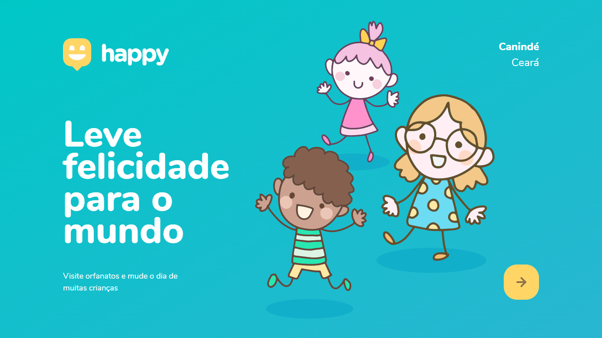
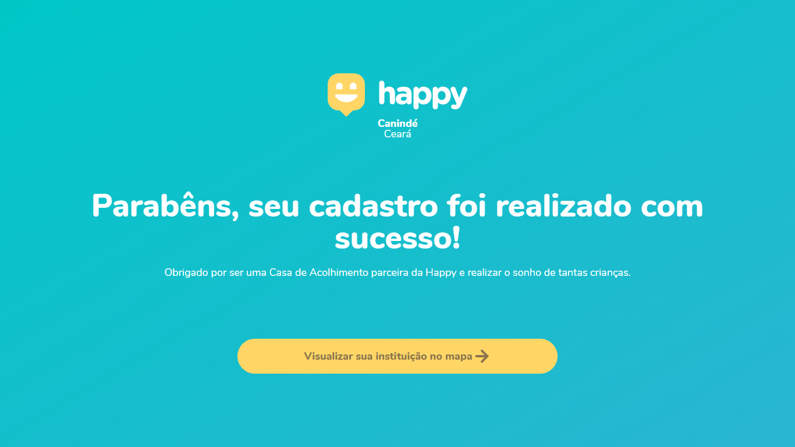

<h1 align="center">Happy</h1>

<h3 align="center">💕 Leve felicidade para o mundo</h3>

  <a href="#about">Sobre</a> &nbsp;&nbsp;&nbsp; | &nbsp;&nbsp;&nbsp; <a href="#techs">Teconologias</a> &nbsp;&nbsp;&nbsp; | &nbsp;&nbsp;&nbsp; <a href="#tools">Ferramentas</a>  &nbsp;&nbsp;&nbsp; | &nbsp;&nbsp;&nbsp; <a href="#milha-extra">  Milha Extra</a>

 

  

 

<h2 id="about">😀 Sobre o projeto </h2>

Olá dev ;) Bem-vindo ao projeto Happy Web. Aplicação construída na 3°edição da NLW promovida pela [Rocketseat](https://www.youtube.com/watch?v=vqrjFnq3-uo&ab_channel=Rocketseat). Com o objetivo de conectar pessoas com orfanatos, essa ideia surgiu a partir de relatos do mentor Mayk Brito, compartilhados com o Diego para uma possível ideia de projeto para a NLW no mês das crianças.

<b>Episódios do Bootcamp</b> (Clique para conferir as lives)

- <b>[Acelerando sua evolução ✔️](https://www.youtube.com/watch?v=cqDBYUIxrVY)</b>
- <b>[Olhando as oportunidades ✔️](https://www.youtube.com/watch?v=zXKSIZLMwvA)</b> 
- <b>[A escolha da stack ✔️](https://www.youtube.com/watch?v=dfi4H877rwQ)</b> 
- <b>[Até 2 ano em 2 meses ✔️](https://www.youtube.com/watch?v=KinaRMOX1MY)</b> 
- <b>[A milha extra ✔️](https://www.youtube.com/watch?v=jh-QrFr8-mo)</b>

<h2 id="techs">🚀 Tecnologias</h2>

Projeto foi desenvolvido com as seguintes tecnologias:

-  [HTML5](https://developer.mozilla.org/pt-BR/docs/Web/HTML)
-  [CSS3](https://developer.mozilla.org/pt-BR/docs/Web/CSS)
-  [JavaScript](https://developer.mozilla.org/pt-BR/docs/Web/JavaScript)
- [Node](https://developer.mozilla.org/pt-BR/docs/Web/API/Node)
- [Express](https://expressjs.com/pt-br/)
- [Handlebars](https://handlebarsjs.com/)
- [SQlite](https://www.sqlite.org/index.html)

<h2 id="tools">🛠 Tools </h2>

As ferramentas utilizadas para desenvolver o projeto:

-  [Visual Studio Code](https://code.visualstudio.com/)
-  [Google Chrome](https://www.google.pt/intl/pt-PT/chrome)
-  [Figma](https://www.figma.com/ui-design-tool/)

<h2 id="milha-extra">Desafio Milha Extra 🥳</h2>

Minha milha extra para a aplicação Happy, desenvolvida na Semana Next Level Week, é uma tela de sucesso. Quando o usuário finalizar o cadastro da sua instituição, ele será redirecionado para essa página.

 

😍 Criado por Alairton Junior. 
